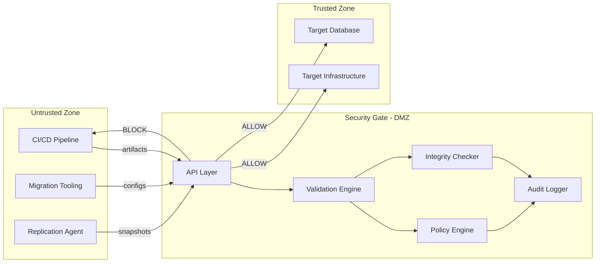
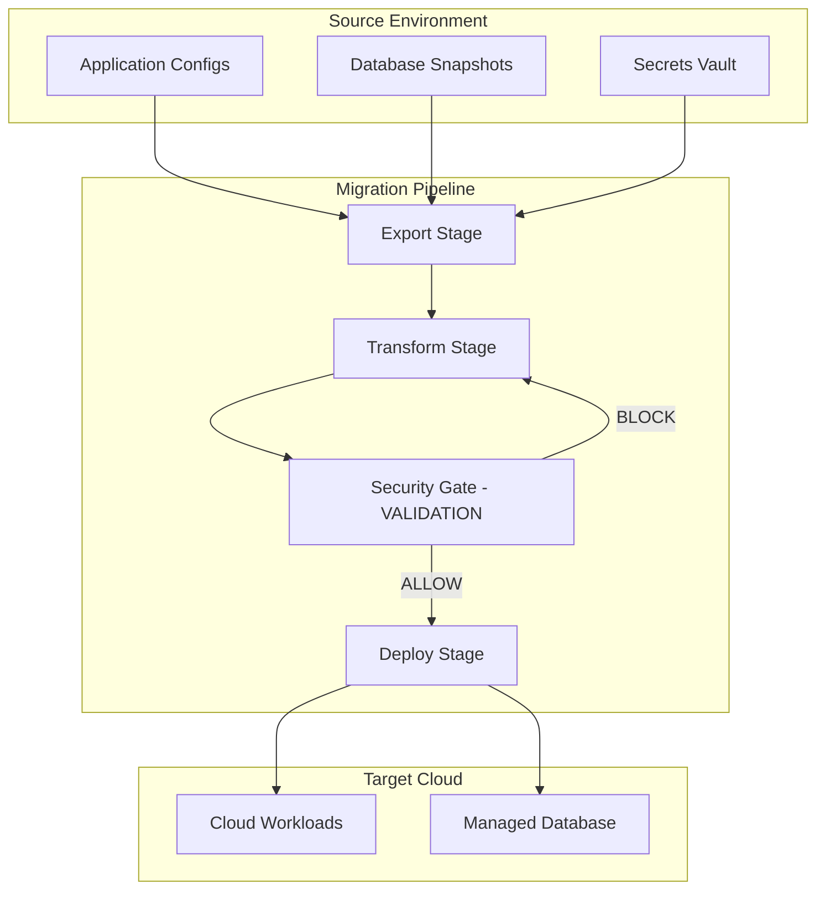
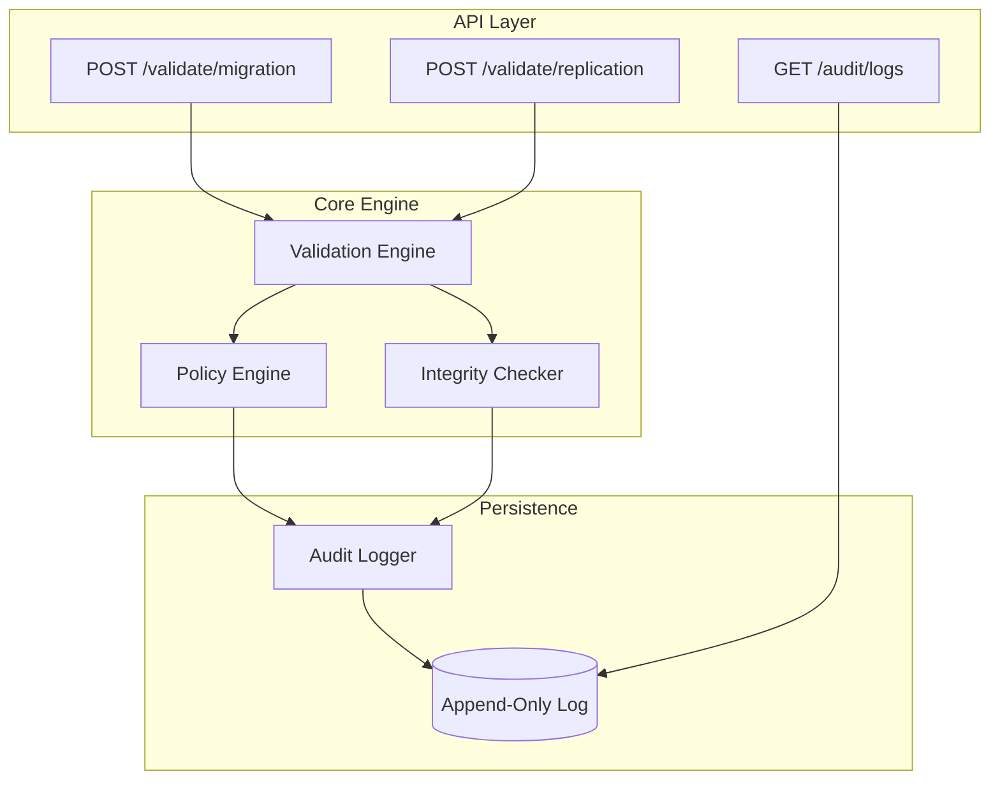
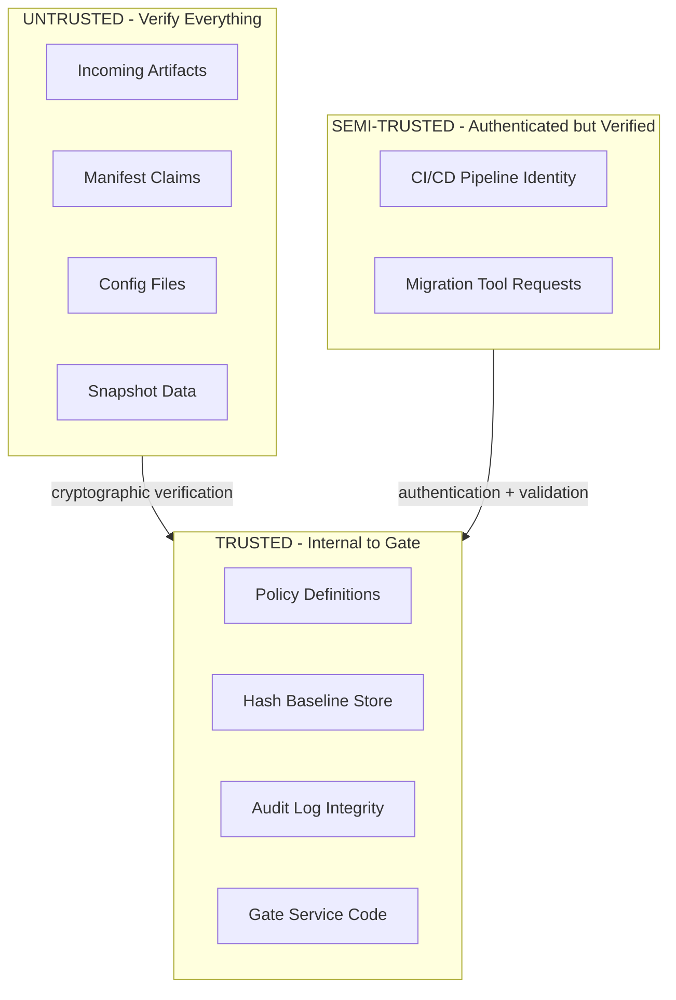
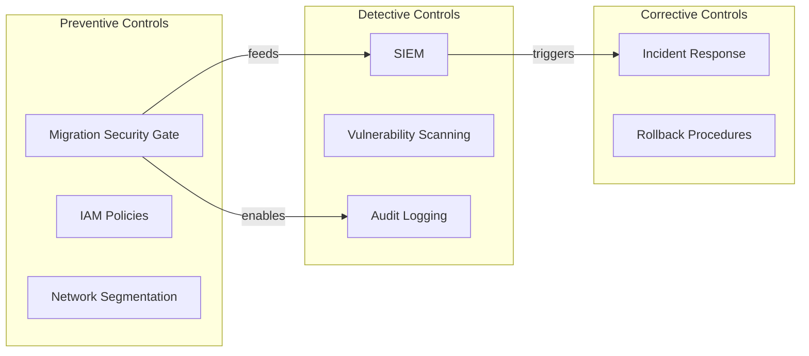

# Migration Security Gate Pattern — Architectural Analysis

## 1. Architectural Form

### 1.1 Pattern Classification

This system implements a **Synchronous Security Gate Pattern** — a mandatory inline control that enforces security invariants before state transitions occur. Unlike monitoring or detection systems, this is a **blocking control plane**.

### 1.2 Architectural Characteristics

| Characteristic | Design Decision | Rationale |

|----------------|-----------------|-----------|

| **Synchronicity** | Synchronous, blocking | No migration proceeds without explicit ALLOW |

| **Statefulness** | Stateless validation, stateful audit | Validation is pure; audit requires persistence |

| **Availability** | Fail-closed | Unavailability = no migrations (security over availability) |

| **Coupling** | Loosely coupled via HTTP | Cloud-agnostic, tool-agnostic integration |

---

## 2. Role in Enterprise Migration Pipeline

### 2.1 Placement in Migration Topology

The Migration Security Gate occupies a **mandatory chokepoint** in the migration data plane:

### 2.2 Integration Points

| Integration Point | Direction | Purpose |

|-------------------|-----------|---------|

| CI/CD Orchestrator | Inbound | Receives validation requests |

| Migration Tooling | Inbound | Validates config artifacts |

| Replication Agents | Inbound | Validates data integrity |

| SIEM/SOC (optional) | Outbound | Streams audit events |

| Policy Repository | Inbound | Loads security policies |

### 2.3 Operational Model

The gate operates in **request-response mode**:

1. Migration tool calls gate API with artifacts
2. Gate validates synchronously
3. Gate returns binary decision: `ALLOW` or `BLOCK`
4. Migration tool proceeds or halts based on decision
5. All decisions are audit-logged regardless of outcome

**Critical invariant**: No artifact reaches target infrastructure without passing through this gate.

---

## 3. Component Responsibilities (Core vs Optional)

### 3.1 Core Components (Security-Critical)

These components are **mandatory** for the security guarantees to hold:

| Component | Responsibility | Failure Mode |

|-----------|----------------|--------------|

| **Validation Engine** | Schema validation, input parsing, pipeline orchestration | BLOCK on any parse/schema failure |

| **Policy Engine** | Environment-aware rule evaluation (prod vs staging) | BLOCK on policy violation |

| **Integrity Checker** | Cryptographic hash verification (SHA-256) | BLOCK on hash mismatch |

| **Audit Logger** | Append-only decision logging with reasons | System halt if audit unavailable |

### 3.2 Optional Components (Operational)

These components enhance usability but are not security-critical:

| Component | Purpose | Degradation Impact |

|-----------|---------|-------------------|

| **Web UI** | Operator visibility, manual validation | CLI/API still functional |

| **Alert Aggregator** | Downstream notification | Audit logs remain source of truth |

| **Metrics Exporter** | Observability integration | No security impact |

### 3.3 Component Interaction Model

---

## 4. Trust Boundaries and Security Assumptions

### 4.1 Trust Boundary Model

### 4.2 Security Assumptions

| Assumption | Implication | Mitigation if Violated |

|------------|-------------|------------------------|

| **Policy definitions are trustworthy** | Policies loaded from controlled source | Policy versioning, change audit |

| **Hash baselines are pre-computed correctly** | Reference hashes represent intended state | Out-of-band baseline verification |

| **Gate service is not compromised** | Validation logic executes correctly | Container hardening, minimal attack surface |

| **Audit logs are immutable** | Decision history cannot be altered | Append-only storage, log forwarding |

| **TLS terminates at gate** | Transport integrity maintained | Certificate pinning for internal comms |

### 4.3 What This System Does NOT Trust

- **Incoming artifact content** — always verified cryptographically
- **Manifest-claimed hashes** — compared against computed values
- **Environment labels in requests** — validated against policy expectations
- **File format correctness** — strict schema validation, fail on malformed input
- **Inline secrets in config** — rejected in favor of secrets_ref

---

## 5. Why This Pattern is Necessary

### 5.1 Gap Analysis: Traditional Approaches

| Traditional Approach | Failure Mode | Why Insufficient |

|----------------------|--------------|------------------|

| Post-deployment scanning | Reactive | Damage already done |

| CI/CD pipeline gates | Trust pipeline integrity | Pipeline can be compromised |

| Cloud-native policies | Provider-specific | Not portable, late enforcement |

| Manual review | Human error, scale | Doesn't scale, inconsistent |

### 5.2 Attack Surface During Migration

Migration is uniquely vulnerable because:

1. **Configuration is in transit** — exposed to interception/modification
2. **Credentials may be embedded** — secrets in config files
3. **Data replication is bulk transfer** — single corruption affects entire dataset
4. **Rollback is expensive** — detecting post-facto requires complex remediation

### 5.3 Security Properties This Pattern Provides

| Property | How Achieved |

|----------|--------------|

| **Integrity** | Cryptographic hash verification of all artifacts |

| **Policy Compliance** | Environment-aware rule evaluation before deployment |

| **Non-repudiation** | Append-only audit log with request correlation |

| **Fail-Safe Default** | BLOCK unless all validations explicitly pass |

| **Auditability** | Every decision includes timestamp, request ID, reason |

### 5.4 Position in Security Landscape

**This pattern is a preventive control** — it stops bad migrations before they happen, rather than detecting them afterward.

---

## 6. Architectural Decisions Summary

### 6.1 Key Decisions

| Decision | Choice | Alternative Rejected | Rationale |

|----------|--------|---------------------|-----------|

| Validation model | Synchronous blocking | Async with eventual consistency | Security requires immediate enforcement |

| Failure mode | Fail-closed | Fail-open with alerts | Security over availability |

| Policy format | Static, declarative | Dynamic, Turing-complete | Predictability, auditability |

| Hash algorithm | SHA-256 | MD5, SHA-1 | Cryptographic strength |

| Log storage | Append-only | Mutable database | Tamper evidence |

### 6.2 Non-Goals (Explicit Exclusions)

- **Runtime application security** — this protects migration, not runtime
- **Cloud provider integration** — cloud-agnostic by design
- **Real-time threat detection** — this is validation, not monitoring
- **Secret management** — validates secrets_ref exists, doesn't manage secrets

---

## 7. Correctness Criteria

The architecture is correct if:

1. **No artifact reaches target without ALLOW decision** — mandatory gate
2. **Hash mismatch always results in BLOCK** — integrity invariant
3. **Policy violation always results in BLOCK** — compliance invariant
4. **Every decision is logged with reason** — auditability invariant
5. **Service unavailability blocks all migrations** — fail-closed invariant

These properties must be verifiable through testing with good/bad artifact examples (T1/T2 scenarios from the implementation plan).
